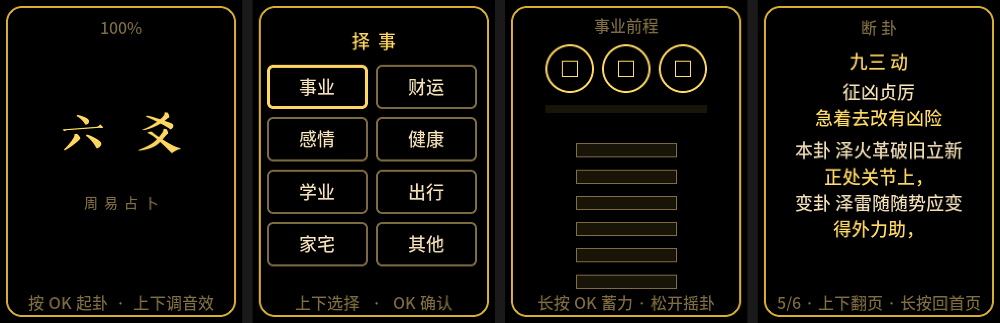

# 六爻占卜 · AI Passport

> **v1.0** —— 2026-09-14 定版。

把 [AI Passport](https://ai-passport.folotoy.cn) 变成随身的六爻起卦盘 —— 择事、取日期、摇卦、看卦，**全程离线**。

## 玩法

**首页** —— 按 OK 进入起卦；上下键调节铜钱音效响度（0–100%，10% 一档，0 就是静音，设置会记住）。

**择事** —— 上下选择所问之事：事业 / 财运 / 感情 / 健康 / 学业 / 出行 / 家宅 / 其他。

**取日期** —— 六爻要看「哪一天」（月建定旺衰、日辰定生克）。本机没有时钟、也不联网，日期由你输入；填过一次就会记住，同一天再起卦按 OK 通过即可。

**摇卦** —— 按住 OK 蓄力、松手掷三枚铜钱，掷六次成卦。铜钱分**背面**（光面）与**字面**（方孔两侧「通」「宝」），数几个背面就行：

| 背面数 | 爻 |
|---|---|
| 一背 | 单（阳爻） |
| 两背 | 拆（阴爻） |
| 三背 | 重（阳爻 · 发动） |
| 无背 | 交（阴爻 · 发动） |

规则不必记 —— 每次掷完，蓄力条下方会直接写清这一掷是什么（如「两背 · 拆 · 阴爻」）。

**蓄力的轻重会参与随机**，所以同一个动作摇两次，卦不会一样；**动爻个数也不固定**，0～6 个都可能。

**看卦** —— 解卦共六页，上下翻页：

| 页 | 内容 |
|---|---|
| 本 卦 | 卦名、上下卦、卦象（亮金为动爻） |
| 卦 盘 | 正统装卦：卦宫、世应、纳甲、六亲、用神、六神、旺衰 |
| 卦 辞 | 卦辞原文，配一句白话 |
| 变 卦 | 动爻变出的卦 |
| 爻 辞 | 该读的爻辞：原文 + 一句白话 |
| 断 卦 | 读法说明；现状 / 趋势；力量 · 虚实 · 双方 · 建议 |

**该读哪几条爻辞，按朱熹《易学启蒙》的变占法**（「断卦」页首行会直接写出来）：

| 动爻数 | 看什么 |
|---|---|
| 0 | 本卦卦辞 |
| 1 | 该动爻的爻辞 |
| 2 | 两爻都看，**以上爻为主** |
| 3 | 两卦卦辞 |
| 4 / 5 | 变卦里**不动**的那两爻 |
| 6 | 乾坤两卦看「用九」「用六」，其余看变卦卦辞 |




**任何一页长按 OK 都能回首页**（摇卦页除外 —— 长按那里是蓄力）。

**待机** —— 60 秒没有按键，屏幕自动进入待机：背光降到 25%，画面换成暗底 + 一枚**先天八卦环**；按任意键即回到原来那一页。那一次按键**只用于唤醒**，不会顺手翻页或起卦。


### 按键对照

| 设备 | 模拟器键盘 | 动作 |
|---|---|---|
| 上 | `↑` / `W` / `K` | 上一个 / 加一 / 调响 |
| 下 | `↓` / `S` / `J` | 下一个 / 减一 / 调轻 |
| OK | `Enter` / `空格` | 确定 / 前进一步 |
| OK 长按 | 按住 ≥0.6 秒再松 | 返回上一层 / 蓄力摇卦 |

## 项目结构

```
liuyao/
├── ui/        UI 与业务逻辑 —— 模拟器和固件编译的是【同一份文件】
│   └── fonts/ 生成好的静态字库（中文字形，走 XIP，不占 RAM）
├── sim/       macOS 模拟器（LVGL 真源码 + SDL，所见即真机所显）
├── fw/        ESP-IDF 固件工程
│   ├── components/bsp/   板级支持包（vendored 自基线，未改动）
│   ├── dist/             历次固件归档（已 gitignore，不进仓库）
│   └── cover/            社区提交用的封面与文案
├── tools/     字库 / 节气等生成脚本
├── assets/    字体与音效源文件
└── images/    README 配图
```

**为什么 UI 只有一份**：`ui/` 被模拟器和固件同时编译（`fw/main/CMakeLists.txt` 直接登记工程外的 `../../ui`）。所以模拟器里看到的就是真机上跑的，不存在"模拟器版和真机版各写一套"的漂移。

## 编译

### 固件（真机）

需要 **ESP-IDF v5.5.3**（首次编译会自动下载 LVGL 到 `fw/managed_components/`）：

```bash
source ~/esp/esp-idf-v5.5.3/export.sh
cd liuyao/fw && ./build.sh
```

产出：

```
fw/build/FoloToy-AI-Passport-liuyao-full.bin    ← 合并镜像（刷机用这个）
fw/dist/…-<时间戳>.bin                          ← 自动归档，防止覆盖丢掉旧版本
```

刷写：起始地址 **`0x0`**，波特率 460800。也可用官方网页刷机页：<https://ai-passport.folotoy.cn/tools/web-flasher/>

> ⚠️ 分区表里有一块受保护的 `cardid` 分区（`0x356000`），存的是设备身份。整包刷写（含网页刷机页）会覆盖到它。`build.sh` 每次都会用官方校验脚本确认合并包在该区域是空白 `0xFF`，**不要绕过这道检查**。

### 模拟器（macOS）

双击 **`启动模拟器.command`** 即可（没编译过会自动编译）。

手动编译：

```bash
cd liuyao/sim
cmake -S . -B build && cmake --build build -j8
./build/sim                      # 交互模式
./build/sim --shot out.png --keys "KKUK" --frames 300   # 无窗口出图
```

出图脚本的按键记号：`U`=上、`D`=下、`K`=OK 短按、`L`=OK 长按、`P`=OK 按住未放。

### 重新生成字库

中文字形是按**实际用到的字符集**生成的静态字库（不是整字体），改了文案后需要重新生成：

```bash
cd liuyao && python3 tools/gen_fonts.py          # 先 --dry-run 看字符数与体积
python3 tools/check_font_coverage.py             # 检查有没有漏字（真机会显示方块）
```

依赖 `lv_font_conv`（`npm i -g lv_font_conv`）。字符集是脚本从 `ui/*.c` 和卦理数据里扫出来的，所以**新写的文案只要落在源码里就会被自动收进去**。

### 官方布局校验（可选）

官方仓库里有一个校验脚本，确认合并包满足**受保护 Flash 布局**（`cardid` 分区必须
是空白 `0xFF`，不得覆盖设备身份）。本仓库不含这个脚本；有的话 `build.sh` 会自动
调用它，没有则跳过并提示。

想启用的话，从 [folotoy/ai-passport](https://github.com/folotoy/ai-passport) 取得
`tools/verify_firmware.py`，放在本项目**上一层的** `ai-passport/tools/` 下即可：

```bash
python3 ../ai-passport/tools/verify_firmware.py fw/build
```

## 一些设计说明

- **解卦为什么是六页、断卦与断语分开**：断卦页按「一条原文／紧跟它自己的白话」成对排 —— 爻辞原文→白话；本卦→其白话（爻位，说现状）、变卦→其白话（五行走向，说趋势）。这已经是七行；四段断语（力量 · 虚实 · 双方 · 建议）再挤进来就要压到 22px 行距，读着累。所以拆成两页：第 5 页讲「卦说了什么」，第 6 页给结论，两页都能用 26px 行距。
- **哪些信息参与判断**：力量（旺衰 × 日辰，25 种）· 虚实（用神是否逢空，2 种）· 双方（世应生克，5 种）· 建议（8 事由 × 5 档旺衰，40 种）。
- **建议为什么按旺衰取句**：早先这行按「事由 × 动爻阴阳」查表（16 条），有两个毛病 —— ① 阴阳与「该进该守」没有必然关系：用神明明休囚无力，只要动爻是阳，照样输出「宜积极进取」，跟上面几行打架；② 锁定一个事由后只有 2 种说法，连起几次就撞同一句。现在改成按**用神旺衰档位**取句：旺则放手、死则停手，与「力量」那行同源。
- **哪些信息真的参与判断**：用神取用、旺衰（月建）、日辰作用、旬空、世应生克、纳甲五行都进断语。卦盘页的**六神**只作气质点缀 —— 传统上它本就「只补形式，不单独判吉凶」，所以刻意不参与。
- **白话一律不判吉凶**：所有白话只描述力量与态势（「势头偏弱」「你方在付出」「此事悬空」），不写成吉或凶。这与通行说法一致：旺衰只计力量，不直接判吉凶；见生不必急着叫好，见克不必急着叫坏。
- **爻辞配白话**：384 条爻辞（64 卦 × 6 爻）逐条配了 ≤12 字的白话。12 字不是随便定的 —— 断卦页一行只能放 12 字，超了会折行顶掉下面的内容。
- **只有一份音频**：整个应用只播铜钱声，响度设置管的正好是它。
- **卦是摇出来的，不是填出来的**：早先有一页「取三位数」，那三个数字偷偷决定了卦象 —— 等于让用户自己填答案。现在删掉了，卦完全由掷币产生，而**蓄力时长会异或进随机数**：既守住「三枚铜钱掷一次」的传统，又让「手上使了多大劲」真的参与进来。
- **动爻个数为什么是 0～6**：真摇的话六爻都可能动、也可能都不动（0 动约 18%、1 动约 36%、2 个及以上约 47%）。所以断卦按变占法分档，多动爻时「以上爻为主」取主爻。早年把动爻锁死成 1 个是为了省事，但那不符合实摇。
- **待机为什么没有时钟**：本机没有 RTC、也不联网 —— 断电就不知道几点，所以「待机时钟」这类画面根本做不了。待机放的是一幅**先天八卦环**（8 个方位 × 3 条爻，阴爻断开），静态画一次就不再重绘，省电全靠背光降到 25%。

## 来源与许可

- **基线**：[FoloToy/ai-passport](https://github.com/folotoy/ai-passport)（MIT，Copyright © 2026 FoloToy）。`fw/components/bsp/` 为 vendored 基线代码，未改动。
- **LVGL**：MIT（由 ESP-IDF 组件管理器下载，不入库）。
- **正文思源黑体**（`assets/fonts/SourceHanSansCN-Medium.otf`）：SIL Open Font License 1.1。
- **标题楷体**（`assets/fonts/ZiHunTaiAKaiShu.ttf`）与 **音效**（`assets/sounds/c_inhand3.mp3`）：请自行确认授权范围后再对外分发。
- `assets/` 只用于重新生成字库；不参与固件编译。

> 字库是按字符集生成的位图数据，编译进固件。
